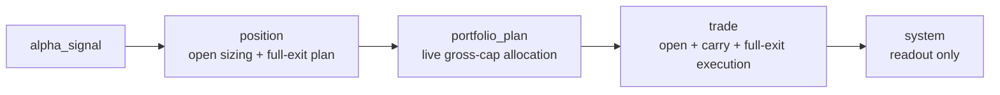

# 阶段十七 Rolling Backtest Minimal V1 规格

日期：`2026-04-21`
状态：`冻结`
文档标识：`stage-seventeen-rolling-backtest-minimal-v1`

## 1. 目标

本规格冻结 `alpha -> position -> portfolio_plan -> trade -> system` 的第一版可滚动回测闭环。

本轮目标不是引入完整交易系统，而是在保持现有模块边界、正式 runner 名称和中文文档治理不变的前提下，让历史回测不再停留在“只开仓、不释放容量”的最小链路。

冻结后的主链路为：

## 2. 边界裁决

本轮边界固定为：

- `position` 继续拥有单标的准入与权重决策，并新增最小 full-exit intent 规划。
- `portfolio_plan` 继续拥有组合总仓裁决，不把组合总仓逻辑下放给 `position`。
- `trade` 继续拥有正式执行物化，并新增 carried position / exit execution 账本。
- `system` 继续保持只读 `trade` 正式输出，不回读 `alpha / position / portfolio_plan`，不承接 exit 业务决策。

明确非目标：

- 不引入 partial exit。
- 不扩展 `alpha_signal` 契约去增加 `signal_low / last_higher_low`。
- 不改现有 public runner 名称。
- 不把 `system` 扩成执行层或回测控制器。

## 3. 默认值冻结

本轮正式默认值冻结为：

- 单标的最终权重硬上限：`0.15`
- 组合总仓默认上限：`0.50`
- 单标的基础分层语义：沿用当前 tiered sizing，不改权重梯度，只增加最终硬上限
- 开仓执行时点：次一交易日开盘
- 平仓执行时点：次一交易日开盘

## 4. position 规格

`position` 保持现有三层输出：

- `position_candidate_audit`
- `position_capacity_snapshot`
- `position_sizing_snapshot`

本轮新增正式表：

- `position_exit_plan`
- `position_exit_leg`

`PositionRunSummary.materialization_counts` 新增：

- `exit_plan_rows`
- `exit_leg_rows`

单标的权重规则冻结为：

1. 先沿用当前 `wave_position_zone` 与 rank-based reduction 推导 `requested_weight`。
2. 再对最终单标的权重应用硬上限 `<= 0.15`。

最小 full-exit 触发语义冻结为：

1. `fast invalidation`
   - 后续同 symbol formal row 满足 `direction != 'up'`
   - 或 `formal_signal_status != 'confirmed'`
   - 次一交易日开盘 full exit
2. `weak structure exit`
   - 后续同 symbol formal row 满足 `wave_position_zone = 'weak_stagnation'`
   - 次一交易日开盘 full exit
3. `time stop`
   - 后续同 symbol formal row 满足 `no_new_span >= 2`
   - 次一交易日开盘 full exit

同一 entry 只保留最早命中的 exit plan。

## 5. portfolio_plan 规格

`portfolio_plan` 保持：

- `portfolio_plan_snapshot`
- `portfolio_plan_run_snapshot`
- `portfolio_plan_checkpoint`
- `portfolio_plan_work_queue`

默认 `portfolio_gross_cap_weight` 由 `0.15` 提升为 `0.50`。

本轮冻结的组合容量语义为“live active-cap accounting”：

1. 不再把所有历史 admitted open 永久累加到总仓上限。
2. 每条 open candidate 的 admitted 决策，必须按其计划开仓日查看当时仍处于 active 的已持仓权重。
3. 若已有持仓在同一计划开仓日完成 full exit，则该容量可在同日重新分配。

`portfolio_plan_snapshot` 需要能稳定表达至少以下口径：

- `planned_entry_trade_date`
- `scheduled_exit_trade_date`
- `current_portfolio_gross_weight`
- `remaining_portfolio_capacity_weight`

保留现有：

- `requested_weight`
- `admitted_weight`
- `trimmed_weight`
- `plan_status`
- `blocking_reason_code`

## 6. trade 规格

`trade` 保持现有 stage-five entry ledger：

- `trade_order_intent`
- `trade_order_execution`

本轮新增 carried-position 家族：

- `trade_position_leg`
- `trade_carry_snapshot`
- `trade_exit_execution`

`TradeRunSummary.materialization_counts` 新增至少以下计数：

- `position_legs_inserted`
- `position_legs_reused`
- `position_legs_rematerialized`
- `carry_rows_inserted`
- `carry_rows_reused`
- `carry_rows_rematerialized`
- `exit_rows_inserted`
- `exit_rows_reused`
- `exit_rows_rematerialized`

最小 rolling execution 语义冻结为：

1. admitted / trimmed open row 继续物化 entry intent 与 entry execution。
2. admitted entry 形成 `trade_position_leg`。
3. 若 position 提供 full-exit plan，则物化 `trade_exit_execution`。
4. 成功 exit 后，position leg 状态必须转为 closed，active carry 释放。
5. `trade_carry_snapshot` 必须能反映每个计划开仓日对应的 active carry 结果。

## 7. system 规格

`system` 保持：

- `system_trade_readout`
- `system_portfolio_trade_summary`

`system_trade_readout` 在本轮应扩为 rolling readout，而不是只读 entry execution。

`system_portfolio_trade_summary` 至少需要稳定汇总：

- `open_entry_count`
- `full_exit_count`
- `active_symbol_count`
- `execution_count`
- `gross_executed_weight`
- `latest_execution_trade_date`

`system` 不得：

- 自己推导 exit 规则
- 回读 `position` 或 `portfolio_plan`
- 触发上游 runner

## 8. 验收

本规格冻结后，工程实施至少要证明：

1. `position` 仍会拦截 `direction != up`、`formal_signal_status != confirmed`、`weak_stagnation` 的入场。
2. 单标的最终权重不会超过 `0.15`。
3. `portfolio_plan` 默认总仓上限为 `0.50`。
4. active carry 会压缩后续可用容量。
5. full exit 后容量会释放，后续候选可以重新 admitted。
6. `trade` 能在多日期 replay 中同时产生 entry、carry、exit。
7. `system` 汇总不再停在“2 笔 filled forever”的静态画面。
8. 模块边界测试继续成立。
